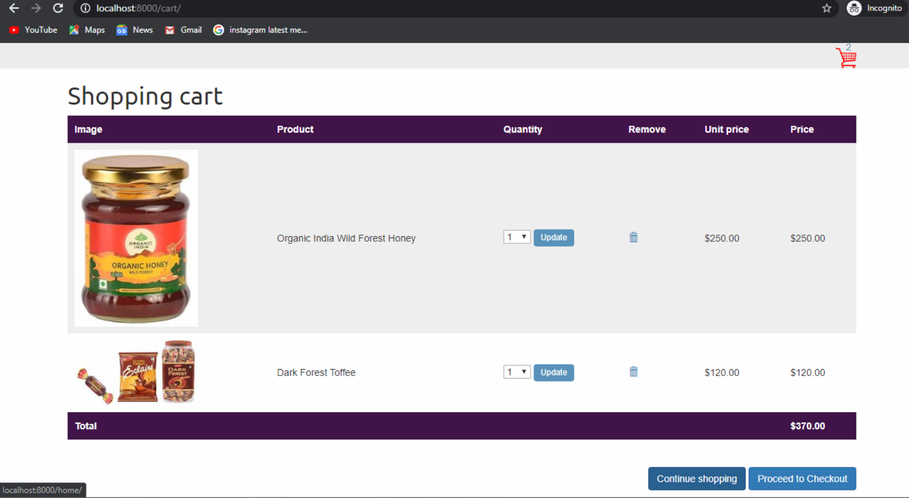

# BuyNow
A Ecommerce Website Developed By Me &amp; My team For Smart India Hackathon Project. BuyNow(Trades Shop) , As its Name suggest this site is generally Developed For selling for tribunals Products Such as Arts, Paintings, Handicrafts and Forest products.
  
<b>This is the Alluring Home Page Of Our Website , Which Requires lots Of improvements & Updation. Since It's An Prototype So its Okay!!</b>

    
<b> This is another image of Our homepage which mostly focus On 4 Products as i told you Earlier. 
  These are
  1. Arts.
  2. paintings.
  3. Handicrafts.
  4. Forest Products.
 
     
  Now This is the Shopping Page of Our Website in which User can add there respective products to their cart. 
 
     
 Now If You Click particular product you will see an interface which looks like. 
 
     
 Our CheckOut Page Also Looks Like this , where you can update or change your product values directly & simply click On the Update Button.   
 
  
  </b>
